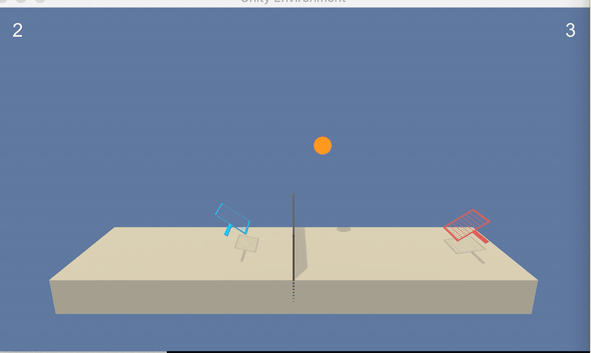

# Project 3: Collaboration

### Introduction

This project implements the third project of the [Udacity Deep Reinforcement Learning Nanodegree](https://www.udacity.com/course/deep-reinforcement-learning-nanodegree--nd893). 

It makes use of [Unity ML Agents](https://github.com/Unity-Technologies/ml-agents) to set up, run, and learn to play the Tennis environment. In this environment the goal is for two agents controlling paddles to learn to "rally" in a tennis-like setting.

The environment is episodic, and continues to run until the ball hits the ground or goes out of bounds. Both the paddles and the ball move along a 2-dimensional plane.

Here is a gif of the agents executing the weights learned through training the model (these are the included `.pth` files in the project directory):




#### State Space

The environment state for each agent is described by 3 size-8 vector observations. For practical purposes these states are treated as they returned by the environment as a 24-dimensional numpy array.  An example starting state for a single agent looks like this:

```python
[ 0.          0.          0.          0.          0.          0.
  0.          0.          0.          0.          0.          0.
  0.          0.          0.          0.         -6.63803244 -1.5
 -0.          0.          6.00063038  6.         -0.          0.        ]
```

#### Action Space

The action space is a 2-dimensional vector for each agent. Each element in the vector is a continuous value representing movement along each dimension.

#### Solving the environment

The Tennis environment is considered "solved" when the average per-episode score over 100 episodes reaches >0.5. The per-episode score is defined as the maximum of the two agents' individual episode scores.

### Getting Started

These instructions assume a recent version of macOS, and was tested on Mojave (v10.14).

1. Ensure Python 3.6 is installed. This can be done by running `python --version` from the command line (or occasionally `python3 --version`). If not installed, it can be retrieved [here](https://www.python.org/downloads/mac-osx/).
2. Ensure "Tennis.app" (included in the repo) opens correctly.  Double-clicking in "Finder" should yield the visual of a blank environment.
3. Install the python runtime dependencies listed in `requirements.txt` by running `pip install -r requirements.txt` from the top level of this repo.

### Training the Agent

For ease of navigation and visibility, all of the relevant classes and code to train the agent from scratch are implemented in the ipython notebook `final-maddpg.ipynb`. To begin training, simply load the notebook and select "Cell -> Run All". If the notebook execution appears to hang, ensure that all Unity environments have been properly closed and Python kernels restarted before trying again.

