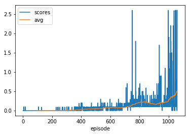
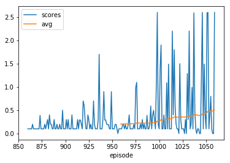

# Report

_Note:_ The DDPG code in this project is largely adapted from the implementation of DDPG from my [Project 2 solution](https://github.com/gilr00y/DRLND-P2), which in turn adapted much of the code from the [DDPG Pendulum](https://github.com/udacity/deep-reinforcement-learning/tree/master/ddpg-pendulum) exercise in the DRLND github repo.  Additionally, some architecture decisions were made after looking at the MADDPG - Lab exercise from section 4.2.15 in the class; however, because much of the lab code dealt with parallelizing training, little to none of it was directly copied, and a much simpler implementation was used.

### Learning Algorithm

The algorithm used for the model is a natural extension of the DDPG implementation from Project 2 that attempts to follow the constraints outlined in the [Multi-Agent Actor-Critic for Mixed
Cooperative-Competitive Environments](https://arxiv.org/abs/1706.02275) by Lowe, et. al., specifically that _"the learned policies can only use
local information (i.e. their own observations) at execution time"_ and no execution-time inter-agent communication is allowed.

##### Actor-Critic Model

DDPG is an actor-critic method. The Actor learns the policy $\pi_\theta$ and outputs the action(s) for the agent to take.  This takes the form of a Neural Network function approximator; in this case the network is a 3-layer fully-connected network, the first two layers with a ReLU activation, and the third layer implementing a `tanh` activation. Batch normalization was initially used for the first and second layers because of its success in the single-actor-critic DDPG implementation in the Continuous Control project, but in this case led to the agents taking too-small actions at each time step. This slowed training and exploration considerably and is perhaps not well suited for this task.

The Critic network approximates the action-value function and also consists of three layers ReLU activations in the first two layers, followed by a linear output layer. Again batch normalization was initially used but discarded. Of note in the critic network is the addition of the action input in the second layer rather than the first; it was discovered through trial-and-error that action values in the first layer contributed much less to the output of the network than in the second layer, thus allowing the network to learn cooperation. I do not know why this was the case, but could be due to the fundamental relationship between first-order observations and higher-order actions taken. A much deeper investigation would be required to determine this.

The DDPG algorithm specifies generating trajectories ($s_t, a_t, r_t,s_{t+1}$) through interacting with an environment using the target actor network to select the actions. These trajectories are stored off-policy in a replay buffer and are then used to train the local Critic action-value approximation through use of the recursive Bellman equation (having substituted the future action with the prescribed Actor's output):

$Q^\pi(s_t,a_t) = E[r(s_t,a_t)+\gamma E[Q^\pi(s_{t+1},\pi(s_{t+1})]]$

This equation gives the Critic loss function, which, when applied with the target Actor's policy, provides a suitable loss function for the Actor's policy itself. Thus it becomes a standard supervised-learning problem at each timestep and can be backpropagated with the autograd features in PyTorch.

##### Multi-agent Considerations

In the tennis environment, to implement a multi-agent DDPG model that acts only upon its own observations, there are two actors and two critics. The actors accept as input only the observations of the corresponding agent, while the critics accept the observations and actions of both agents. Additionally, the loss function of the critic is calculated using the rewards only of the corresponding agent.

It is common to see similar algorithms implemented with a single shared critic, such that the same action-value function is used to train both actors, but without exposing the full set of observations to the actors this method too easily leads to local minima halting training progress. This setup was tried in several different variations for this project, but frequently led to poor training or a single agent stalling. It should be noted, however, that with a certain amount of knowledge about the observations given (eg each agent measures its environment from its own vantage point), then inputs to the critic can be adjusted such that the agents "share" their first-person experiences.

As-is, this project assumes no context regarding the state observations and is fully generalizable to other environments or domains.

### Tuning

To achieve the performance described below, certain hyperparameters for the algorithm had to be tuned to find a satisfactory result. The hyperparameters chosen were determined through trial-and-error, where necessary.

These hyperparameters are described as follows:

**Replay Buffer Size**

`buffer_size = int(1e6)` 

The replay buffer size is the number of agent experiences available in the buffer for sampling during the training stage of the fully-connected MLP network. Thus a larger value ensures that the network is learning from experiences outisde of its own recent history.  However, particularly since the exploration-- implemented as an Ornstein-Uhlenbeck noise component added to the actions taken-- decreases with the number of episodes recorded, constraining the buffer size too much can leave the agent training only from recent experiences with low variability.

**Batch Size**

`batch_size = 256`

This is the number of samples taken from the Replay Buffer each time a critic is trained. Increasing the batch size (to 1024 or 2048) led to greater stability in training but also increased the training time. A batch size lower than 100 led to quick but highly unstable training.

**Gamma - Discount Factor**

`GAMMA = 0.999`

This is the time-discount factor, which is applied to the expected action-value of the subsequent state. A low value here optimizes for short-term rewards, while a value close to 1 discounts future rewards very little. Because of the sparse rewards early in training changing this value did little to change the performance and was mostly left alone.

**Tau**

`tau = 7e-3`

This controls how much the target actor and critic networks are updated after each learning and optimization stage.  A value of 1 replaces the target network weights entirely with the local network weights, while a value of zero equates to no update. This value was crucial in the speed and stability of training, and I experimented with values ranging from `1e-5` to 1. A low value led to a low ceiling on the score the model could achieve, and a high value led to an unstable series of peaks. Again this is related to the sparsity of early rewards within the environment, since the algorithm must be capable of capitalizing on a series of fortuitous experiences but stable enough to maintain the benefit.

**Learning Rate**

`lr_actor = 1e-3`

`lr_critic = 1e-3`

The learning rate is a parameter of the FC network optimizer that determines how much the weights are updated on each pass through the optimizer (in this case ADAM for both actor and critic networks).

**Noise ** 

`action += (1 - min(ep_num/600., 1)) * self.noise.sample()`

Noise was added to the output of the actor at each step as a method of introducing exploration to the agent. This was repeatedly tuned, and success was achieved when noise was applied for the first 200 episodes, then for every second episode until episode 600 in a linearly-decreasing fashion. Because of the complexity of actions required for success and, again, the sparsity of rewards, the agents must be able to capitalize on prior successes through exploitation while continuing exploration through higher-score episodes.

### Performance

This implementation "solved" the environment (gaining a score of >0.5 averaged over 100 consecutive episodes) after 1059 episodes. The console output and a plot of the scores for both the full run and the last 200 episodes are displayed below. Note that the console output is misleading, since it only output the `AVG` and `MAX_AVG` every 10 episodes, and did not output the final score when it was solved at 1059.

### Future Improvements

#### Quota Experience Replay

As is apparent in the plots above, positive rewards are sparse in this environment, particularly early in training. This leads to a situation where only a small percentage of the trajectories sampled during training have positive indications of performance. This is in akin to training an image classifier to identify dogs when the training set is mostly cats. In image classification this is sometimes dealt with by culling the training set or manipulating the positive samples with image transforms to make the classifier more robust. Something similar could be done here, where a quota of sorts would be placed on the minimum number of "positive" samples from the buffer.

#### Shared Critic Network

This was attempted but not realized due to the context required (which may be available, but I have not yet looked for it). In the correct implementation of this, each experience would be recorded in the same way, but during training it would be transformed, if necessary, so that an observation of Agent #1 would appear identical to an observation of Agent #2. This transformation would correct, for example, an absolute position for a relative position (eg "one step East" vs "one step toward the net", or "ball moving West" vs "ball moving toward agent"). This way the agents could use the same Actor and Critic networks to share experiences and train more efficiently, while still using only local observations to execute their actions.

#### Hard Reset/Agent Bootstrap

A problem found repeatedly in this exercise was that one agent would steadily progress in learning while the other got stuck in a local minimum and repeated the same one or two actions. I addressed this by adding a check to the score after a certain number of episodes, but this could be more elegantly implemented as a check on the progress of an individual agent and, for example, the moving average of its rewards. If it failed the check, then _just that agent_ would be reset. This would allow preservation of the well-trained agent as well as the experience buffer. If used in conjunction with the Shared Critic or some variation on the same idea, the agents previous experiences as well as input from the successful agent could be used to "bootstrap" the agent that was reset.

